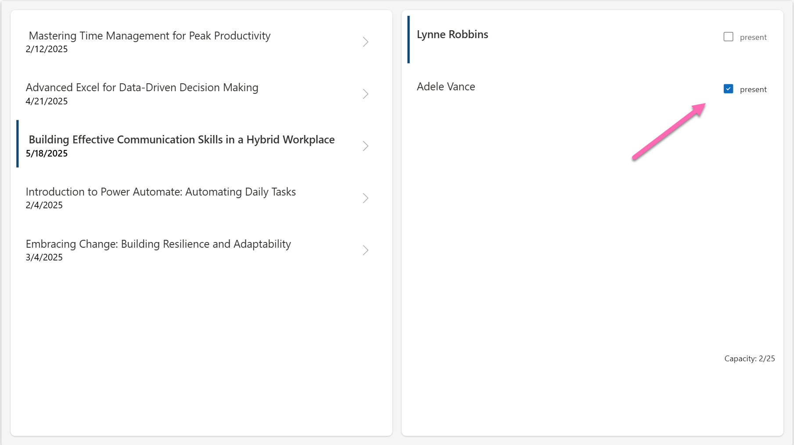
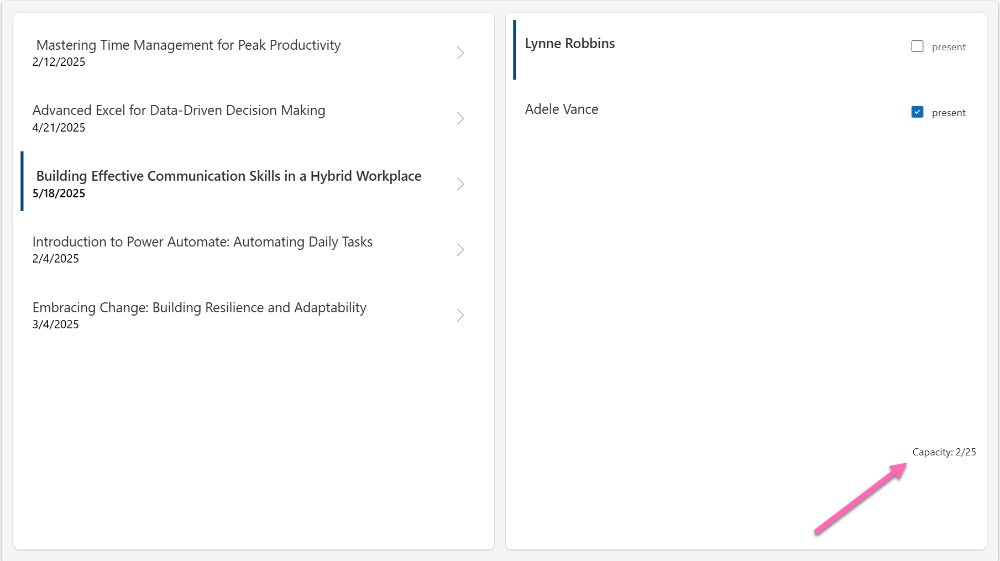

# Check attendance with Patch

We now want to check in the workshops, if everyone who signed up is present.

## Checkbox

* in the gallery (!) add a checkbox, properties:
   * **Checked**: `ThisItem.isPresent`
   * **Label**: `"present"`
   * **OnCheck**: `Patch(Registrations,ThisItem,{isPresent: true})`
   * **OnUnCheck**: `Patch(Registrations,ThisItem,{isPresent: false})`
   * **Visible**: `CountRows(Filter(colRegistrations, 'Workshop Title'.Id = gal_workshops.Selected.ID))>0`

### Explanation Patch

The Patch function will update an existing row in a table. To determine, what needs to be update, we need to provide:

* the table (in our case, this is the `Registrations` List)
* the row in this table (in our case, it's `This.Item`)
* the column that needs to be changed and the value it needs to be changed to. We will pass this in as an object: `{isPresent: true}` or {isPresent: false}

Combined our function looks like this: `Patch(Registrations,ThisItem,{isPresent: true})`.

### Explanation Visible

We want to hide the checkbox and its label, if there are no attendees registered for the selected workshop. We can count how many people registered with the `CountRows` function and pass in:

* the table, which rows shall be counted - which is the **Items** of the `gal_registrations`: `Filter(colRegistrations, 'Workshop Title'.Id = gal_workshops.Selected.ID)`

* a condition: `>0`

As a result, it is: `CountRows(Filter(colRegistrations, 'Workshop Title'.Id = gal_workshops.Selected.ID))>0`.

💡 Maybe you would expect something like `If(CountRows(Filter(colRegistrations, 'Workshop Title'.Id = gal_workshops.Selected.ID))>0, true, false)` in here (and you may still do that as it is not wrong, just not necessary: As we only evaluate if a statement is true or not, we do not need to wrap it into an `If` function.)

✨ Remember, you are awesome!

## Capacity

* Add a text label `lbl_capacity`, properties:
   * **Text**: `"Capacity: "&CountRows(Filter(colRegistrations,'Workshop Title'.Id=gal_workshops.Selected.ID))&"/"&gal_workshops.Selected.Capacity`
   * **Align**: `'TextCanvas.Align'.Center`
   * **AlignInContainer**: `AlignInContainer.End`
   * **VerticalAlign**: `'TextCanvas.VerticalAlign'.Middle`

### Explanation Capacity Label

We want to show how many slots are already taken from our given **Capacity** (remember, that was a column in in **Workshops** List)

- the word `"Capacity: "` (yes, with a space after the colon and also with double quotes)
- an ampersand `&` - this will concatenate (stich together) our strings and expressions
- the `CountRows` function that again counts how many registered attendees we have in tis workshop `CountRows(Filter(colRegistrations,'Workshop Title'.Id=gal_workshops.Selected.ID)`
- another `&` followed by a `"/"` and another `&`
- finally the `Capacity` of the selected workshop `gal_workshops.Selected.Capacity`

as a result:

`"Capacity: "&CountRows(Filter(colRegistrations,'Workshop Title'.Id=gal_workshops.Selected.ID))&"/"&gal_workshops.Selected.Capacity`